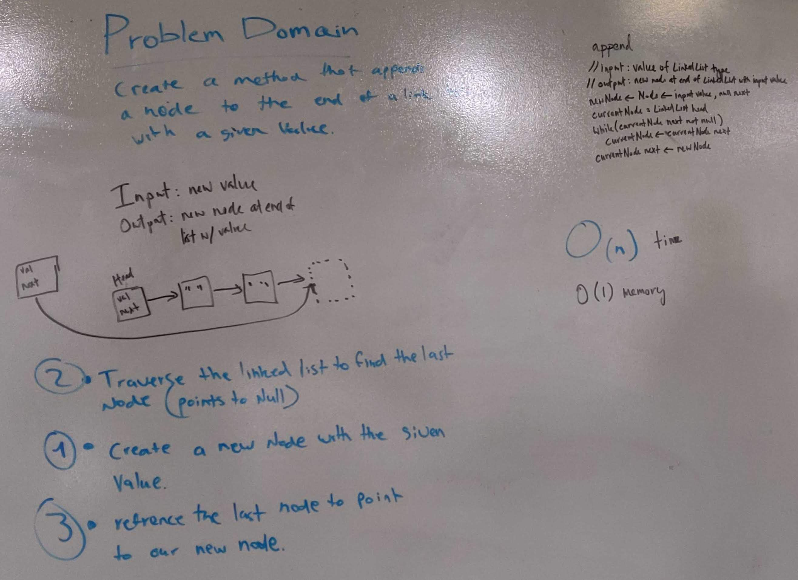

# Linked List
Code Fellows 401 Java Code Challenges 5 & 6

## Challenge
Implement a linked list with nodes, constructors, as well as insert, includes, append, insertBefore, insertAfter and toString methods.

## Approach & Efficiency
1. Develop tests for each of the following
2. Create a Node class that has properties for the value stored in the Node, and a pointer to the next Node.
3. Within your LinkedList class, include a head property. Upon instantiation, an empty Linked List should be created.
4. Define a method called insert which takes any value as an argument and adds a new node with that value to the head of the list with an O(1) time performance.
5. Define a method called append which takes any value as an argument and adds a new node with that value to the tail of the list with an O(1) time performance.
6. Define a method called insertBefore which takes any value as an argument and a reference value and adds a new node with that value before the first node with the referenced value.
7. Define a method called insertBefore which takes any value as an argument and a reference value and adds a new node with that value after the first node with the referenced value.
8. Define a method called includes which takes any value as an argument and returns a boolean result depending on whether that value exists as a Node’s value somewhere within the list.
9. Define a method called toString which takes in no arguments and returns a string representing all the values in the Linked List, formatted as:
   "{ a } -> { b } -> { c } -> NULL"
10. Test

## Link to Code
[ArrayReverse.java](../src/main/java/code401Challenges/LinkedList/LinkedList.java)

## Whiteboards

append Method

insertBefore Method
   
